# kovan网络测试yvault功能

#### 前提
你需要掌握remix和MetaMark工具的使用和kovan测试网的eth测试币。
#### 说明

dforce平台在kovan测试网部署有生息合约，通过编写对应[strategyDforceUSDT_kovan.sol](contracts/StrategyDforceUSDTKovan.sol)策略合约，进行投资，测试整个项目的运行。

#### 部署和测试工具(remix)

1.将本目录下，contracts目录中所有内容，拷贝到remix中,github目录时remix自动导入的包，可以忽略.

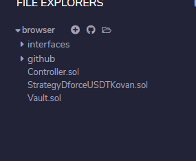

2.按照以下顺序部署三个合约

  1. 部署controller
      - 部署controller合约,需要参入的参数为基金会地址，可以填写为你自己的账户地址，该参数在本测试中没有使用。
       
      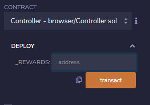
      
      - 设置管理员地址,合约有权限管理，只有管理员才能进行相关操作
      
      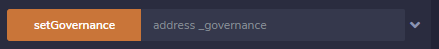

  2. 部署vault
  
     1.部署参数
        - _controller: controller合约的地址
        - _token: token的地址，也就是USDT代币的地址
        - _earnLowerlimit: 最小投资触发数，当vault存款大于当前值时，自动进行投资
        
     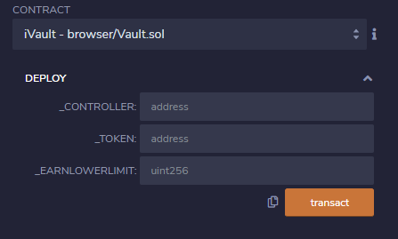
     
     2.设置管理员
     
     
     
  3. 部署strategy
  
     1.部署参数
        - _controller: controller合约地址
        
     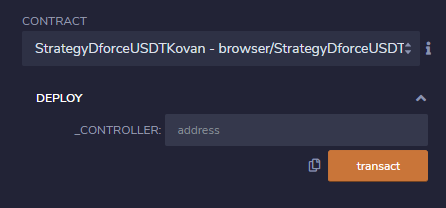
     
     2.设置管理员
     
     
     
3.通过controller的setVault和setStrategy设置token(USDT)对应的vault和strategy

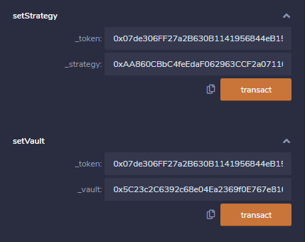

#### 测试

1.首先，我们需要将USDT通过ERC20接口导入到remix中，具体的操作见下面的gif图。

kovan测试网**USDT地址:0x07de306FF27a2B630B1141956844eB1552B956B5**

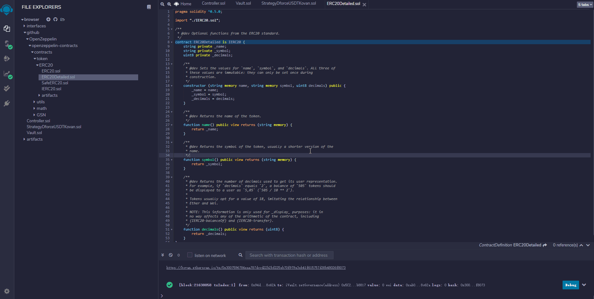

2.我们需要通过USDT合约授权vault合约，允许转多少USDT到vault中。例如我授权vault，允许转100USDT给vault.

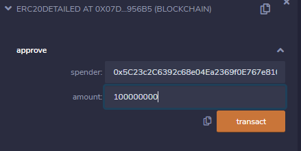

3.执行完上面操作后，就可以进行存币操作，现在，我将100USDT存入到vault中。

4.同时我们可以通过vault查询返回给我的iusdt的数量

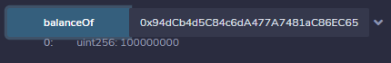

5.通过interfaces中DERC20合约，将dUSDT导入到remix，同时查询strategy是否有dToken

kovan测试网**dUSDT地址:0x4c153111272cB826A80627c4A51c48ccB7d3153B**

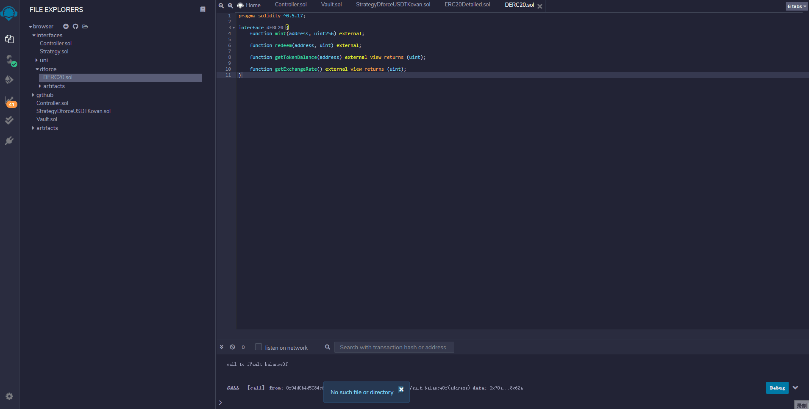

6.测试完后，通过vault的withdraw和withdrawAll取出存入的USDT

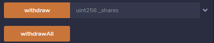

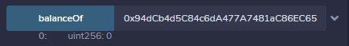
