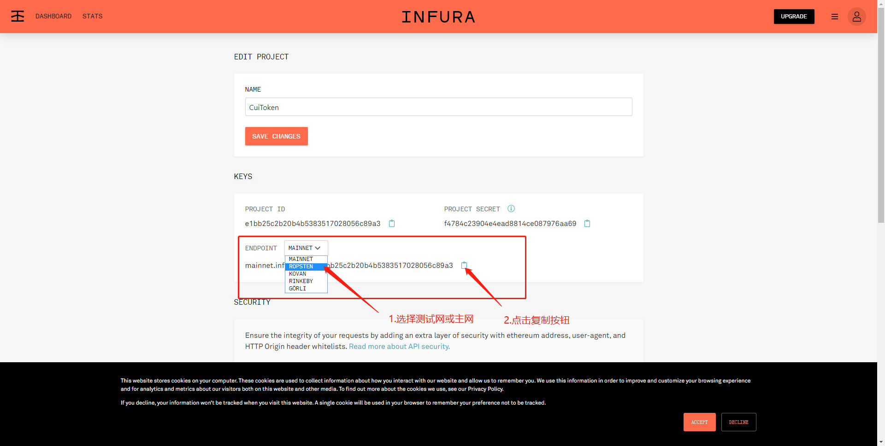

# 测试yvault

#### 用法

1.准备kovan账户和eth

2.将**2_deploy_yvault.js**拷贝到migrations目录下

3.注册Infura，获取测试网或主网的KEY

> [infura.io](https://infura.io)


4.修改truffle-config.js文件，并安装插件

```shell script
npm install truffle-hdwallet-provider -s
```

```js
var HDWalletProvider = require("truffle-hdwallet-provider");  // 导入模块
var mnemonic = "oppose say prevent raven mystery fiber program pupil poverty else pill enact";  //MetaMask的助记词。

module.exports = {
  	networks: {
        kovan: {
            provider: function() {
                // mnemonic表示MetaMask的助记词。 "ropsten.infura.io/v3/33..."表示Infura上的项目id
                return new HDWalletProvider(mnemonic, "https://kovan.infura.io/v3/xxxxxx", 0);
            },
            network_id: "*",  // match any network
            gas: 4600000,
            gasPrice: 12000000000,
            confirmations: 2,    // # of confs to wait between deployments. (default: 0)
            timeoutBlocks: 200,  // # of blocks before a deployment times out  (minimum/default: 50)
            skipDryRun: true     // Skip dry run before migrations? (default: false for public nets )
        },
  	}
};
```

5.部署
```shell script
truffle migrate  --network kovan
```


